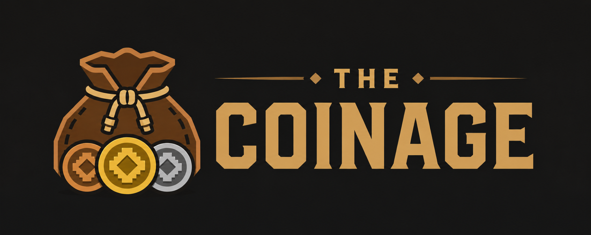

# The Coinage

The Coinage adds an ancient physical currency to Minecraft: Copper, Silver and Gold Coins, a specialized Coin Purse, new trading opportunities, world loot, archaeology rewards and a currency system designed for modded gameplay.

## Features

- Physical coins that complement — never replace — Emeralds.
- A server-authoritative Coin Purse with automatic pickup, an inventory UI and accessory-slot support.
- Villager and Wandering Trader offers, including ratio-aware coin exchange.
- Additive structure and archaeology loot; optional, disabled-by-default mob drops.
- Datapack-defined trades and mob drops, plus a stable integration API for rewards and atomic payments.
- English and Russian localization.

## Requirements

- Minecraft 1.21.1 or 26.2
- NeoForge
- Java 21 for Minecraft 1.21.1; Java 25 for Minecraft 26.2
- [U-API](https://github.com/tracerxbrhd/u-api) (required)

Curios and Accessories are optional. The Coin Purse fits any Curios slot and the Accessories Belt and Charm slots. The Coinage does not require other Underworld Studio gameplay mods.

## Installation

Install NeoForge and U-API for the same Minecraft version, then place The Coinage JAR in the `mods` directory on both client and server.

Downloads: [Modrinth](https://modrinth.com/mod/the-coinage) · [CurseForge](https://www.curseforge.com/minecraft/mc-mods/the-coinage) · [GitHub Releases](https://github.com/tracerxbrhd/the-coinage/releases)

For integrations and modpacks, see [API documentation](docs/API.md) and the [modpack guide](docs/MODPACK.md).

The Coinage is part of the Underworld Studio ecosystem and uses U-API as its shared technical foundation. It remains fully usable as its own gameplay mod.

## License

All Rights Reserved. See [LICENSE](LICENSE).
